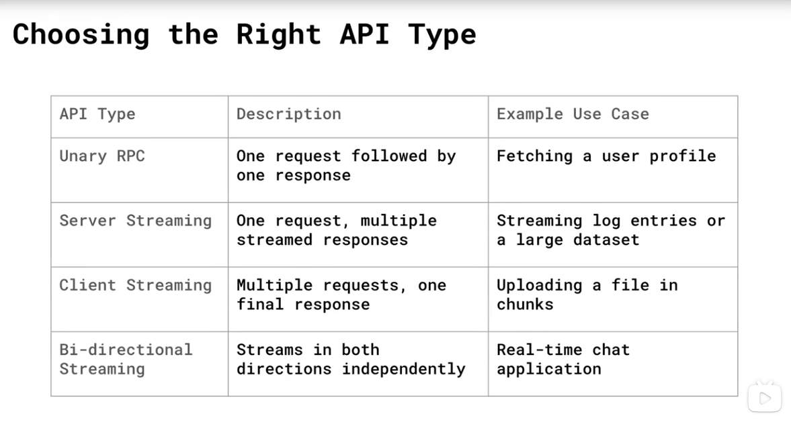

# grpc-services-with-golang

# Folder Structure 
### `/usermanager/`
- we store the service defintion 
- we store the protobuf generated from the .proto file 

### `/client/`
- we store the client code that will send request to the server to create a new user 

### `/server/`
- we store the server code that will create user resource and returns the user details to the client 

